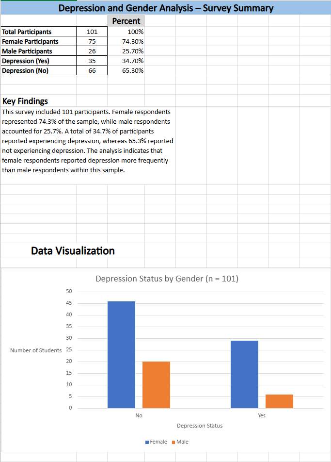
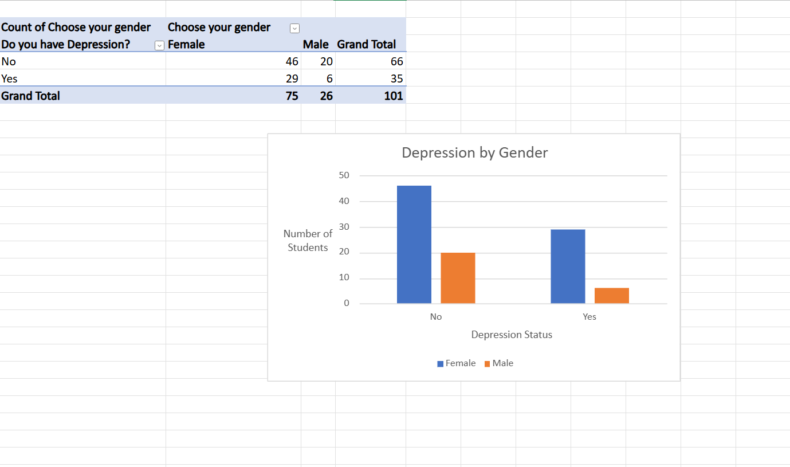
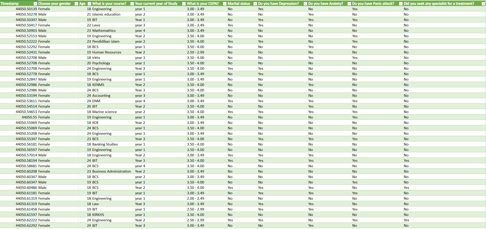

# Depression and Gender Analysis Using Microsoft Excel

## Overview

This project analyzes survey responses from 101 participants to examine the relationship between gender and depression.

The project was completed using Microsoft Excel and demonstrates skills in data cleaning, Pivot Tables, descriptive statistics, percentage calculations, and data visualization.

## Dashboard Preview

## Objectives

* Organize and clean survey data
* Analyze depression responses by gender
* Calculate percentages and summary statistics
* Create visualizations to communicate findings
* Develop a professional dashboard-style summary sheet

## Dataset

* Total Participants: 101
* Female Participants: 75 (74.3%)
* Male Participants: 26 (25.7%)
* Depression (Yes): 35 (34.7%)
* Depression (No): 66 (65.3%)

## Tools Used

* Microsoft Excel
* Pivot Tables
* Pivot Charts
* Percentage Calculations
* Data Visualization

## Key Findings

* Female respondents represented the majority of the sample.
* Approximately one-third of participants reported experiencing depression.
* Female respondents reported depression more frequently than male respondents within this sample.
* Pivot Table analysis allowed efficient comparison of depression status across gender groups.

## Analysis Visualization

## Raw Data Sample

## Skills Demonstrated

* Data Cleaning
* Data Analysis
* Microsoft Excel
* Pivot Tables
* Dashboard Creation
* Research Methods
* Data Visualization

## Author

Tahmid Ahmed Adib  
Psychology Major | University at Buffalo
